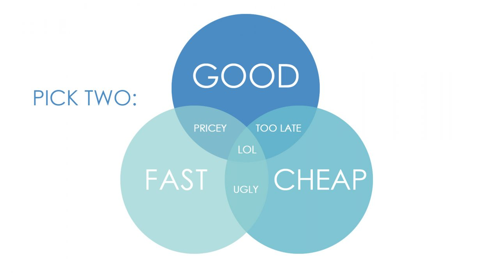

# Utilizing Yelp Cost Estimates for Estimating Neighborhood Affluency
Authors:  

[Jamie McElhiney](https://github.com/jmce619)  
[Julie B](https://github.com/juliebga)  
[Freda Xin](https://github.com/FredaXin)  

___
## Problem Statement
Have you ever driven through an unfamiliar neighborhood and been curious as to how affluent that neighborhood may be? In an unfamiliar neighborhood it may be hard to tell what kind of income bracket the inhabitants may be in and how much they are willing to shell out for their place of residence. We know a one-bedroom condo in a high-end city may be sold for more than a two story detached home in a rural area. Neighborhood is a harsh determining factor in home sale price. If the traditional information of determining neighborhood affluence is missing (e.g. tax returns or unemployment rate), how else can we measure neighborhood wealth?  
For our project, we want to be able to gauge neighborhood affluence using Yelp business data.  A prevalence of luxury shopping stores and high end restaurants mixed with higher commercial activity could be cue for affluent neighborhoods. We will look to uncover valuable information from our data set that will indicate which Yelp features may be key factors in assessing a neighborhood’s affluence. 

(**Place holder; Change later**)
This tool will estimate the affluence of a neighborhood based on the number of $ of businesses and services (according to Yelp) in a given neighborhood. ($, $$, $$$) This tool will expect to get, as an input, a list of zip codes or names of neighborhoods and will estimate the wealth of the locality. While traditional methods typically estimate wealth of a locality based on demographic characteristics (e.g. income or unemployment rate), the novelty of this approach is in its use of big data related to commercial activity and cost of product and services as an indicator for affluency.
___
## Executive Summary

During the data collection process, we used [Yelp Fusion
API](https://www.yelp.com/developers/documentation/v3/get_started) and collected
30,293 Yelp business information in NYC. To measure neighborhoods
afflunency, we used property values, i.e. home prices. This approach makes
intuitive sense, since a neighborhood's property can reveal how affluent the
residents are in that area. In addition, this approach is capable to incorporate
the most up to date real estate information (since NYC Department of Finance
generated data on a rolling basis for the past 12 months); this is an
advantage comparing to past approaches of using IRS tax return
(which can be out of date and does not offer the current affluency status of a neighborhood).

For our project, we chose NYC as a case study to develop our models: NYC has
a high density of population, high concentration of businesses on Yelp, and high
diversity of types of businesses and neighborhoods, which are desirable when
training models; We also envisioned to generalize our models and to make it
transferrable to other urban areas in the U.S and took the initial steps toward this
direction in our modeling phase. 

During the EDA process, we investigated Yelp's $ rating and found that the
most frequent ratings are $$ for NYC. We further break this down into the 5
boroughs and found that $ rating are the most common price ratings for Queens,
Brooklyn, and Bronx; whereas $$ signs are the most common price rating for
Manhattan and Satan Island. The fact that Satan Island has a very high percentage
of $$ rating led us to rethink our assumption: is Yelp's $ rating a good
predictor for a neighborhood's affluency status? We then investigated other
features from Yelp's business listings, and found that (business)
categories yielded far more illuminating insights about a neighborhood's
affluency status. These features derived from the categories proved to be very
predictive. In addition, we used K-means to generate 80 clusters based on
latitudes and longitudes: those clusters defined our 'neighborhood'.  

As we stepped into the modeling phase, we developed two different approaches:
first, we used the clusters to generate aggregated data for each cluster and
developed 4 types of classification models: Logistic Regression, KNN,
Tree based models, and PCA. This approach has the advantage of high interpretability since
each observation represents the overall characteristics of the businesses in a given
neighborhood. In addition, this approach was our initial step of generalizing the
models that will be applicable for all urban areas in the U.S.. For the second
approach, we used all individual Yelp businesses as observations (about 20k) and
developed 4 types of classification models: Logistic Regression, KNN, Tree based
models, and Voting Classifier. In short, the first approach is a good and cheap
approach, while the second is fast and cheap. 

 
 [Image source](https://www.dancker.com/blog/good-fast-cheap/)

 Spoiler: how can we develop a good and fast approach, you might ask (hint: use
 some other data sources than Yelp, or pay for the work? ;))

___
## Data Dictionary: Yelp

| Name | Data Types (Pandas) | Description |
|---|---|---|
|id|object|a unique ID for each business, e.g. E8RJkjfdcwgtyoPMjQ_Olg|
|alias |object|business name alias| 
|name|object|business name|
|image_url|object|URL of photos taken at a given business|
|is_closed|bool|True if the business is currently open, else False|
|url|object|url of business listing on Yelp|
|review_count|int64|Number of reviews|
|categories|object|List of category title and alias pairs associated with this business|
|rating|float64|Rating for this business (value ranges from 1, 1.5, ... 4.5, 5)|
|coordinates|object|Coordinates of this business|
|transactions|object|List of Yelp transactions that the business is registered for, such as pickup, delivery and restaurant_reservation.|
|price|object|Price level of the business. Value is one of \\$, \\$\\$, \\$\\$\\$ and \\$\\$\\$\\$.|
|location|object|Location of this business, including address, city, state, zip code and country.|
|phone|object|phone number of the business|
|display_phone|object|Phone number of the business formatted nicely to be displayed to users. The format is the standard phone number format for the business's country.|
|distance|float64|Distance in meters from the search location. This returns meters regardless of the locale.|

___
## Conclusion
___
## Next Steps
___

## References
- [Github Link for DSI-NYC (2) students' past
work.](https://github.com/Shaddyjr/predicting_affluence_using_yelp)
- 